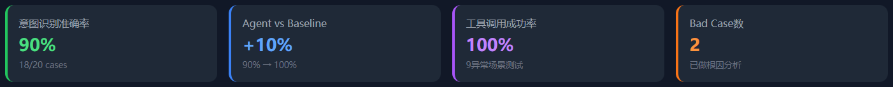
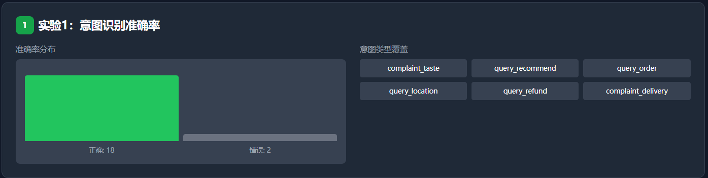
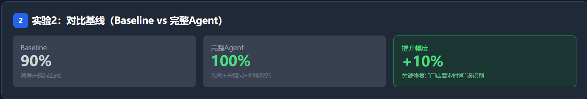
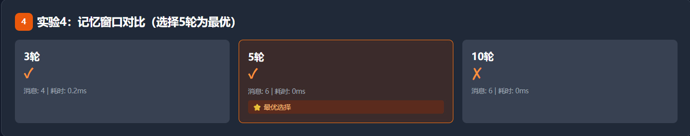
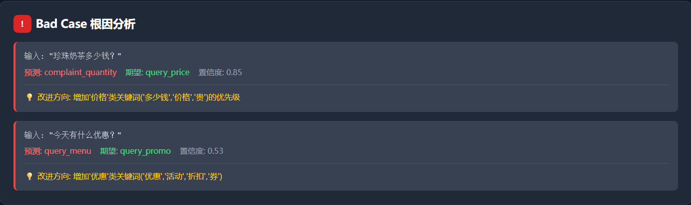

# BubbleMate 项目总览

## 项目简介

**BubbleMate** 是一个智能奶茶店客服Agent项目，展示大模型应用层的核心能力：
- 意图识别与路由
- MCP工具调用
- 会话记忆管理
- Agent思考链可视化

## 目录结构

```
BubbleMate/
├── backend/                    # 后端服务
│   ├── agent/
│   │   ├── intent_recognizer.py    # 意图识别（规则+关键词）
│   │   ├── react_agent.py          # ReAct Agent核心循环
│   │   └── memory_manager.py       # 滑动窗口记忆管理
│   ├── tools/
│   │   └── tool_registry.py        # MCP工具注册
│   ├── api/
│   │   └── main.py                 # FastAPI入口
│   ├── core/
│   │   └── config.py               # 配置管理
│   └── requirements.txt
│
├── frontend/                   # 前端界面
│   ├── app/
│   │   ├── page.tsx                # 主页面
│   │   ├── layout.tsx              # 根布局
│   │   └── api/                    # API路由代理
│   ├── components/
│   │   ├── ChatInterface.tsx       # 聊天界面
│   │   ├── ThoughtChainPanel.tsx   # 思考链展示 ⭐
│   │   ├── ToolVisualization.tsx   # 工具可视化 ⭐
│   │   └── Header.tsx
│   ├── lib/
│   │   └── api.ts                  # API封装
│   └── package.json
│
├── data/                       # 数据文件
│   ├── bubble_tea_all.json         # 25家奶茶店信息
│   ├── real_reviews.json           # 15条真实差评
│   ├── intent_training_data.json   # 意图训练数据(40条)
│   └── qa_pairs.json               # 问答对(21条)
│
├── scripts/                    # 工具脚本
│   ├── crawler.py                  # 高德地图POI爬虫
│   ├── crawler_mall.py             # 商场爬虫
│   ├── merge_data.py               # 数据合并
│   ├── analyze_reviews.py          # 差评分析
│   └── test_agent.py               # Agent测试
│
├── docs/                       # 文档
│   ├── 30天执行计划.md
│   └── 技术架构设计.md
│
├── start.bat                   # Windows启动脚本
└── start.sh                    # Linux/Mac启动脚本
```

## 核心亮点

### 1. 思考链可视化 ⭐
前端实时展示Agent的推理过程，这是大模型应用层调试的核心手段。
```
【思考】用户意图: complaint_taste, 类别: 口感投诉
【行动】匹配投诉处理模板
【回复】非常抱歉...
```

### 2. 工具调用可视化 ⭐
展示MCP工具的实时调用状态：
- 订单查询 📦
- 库存查询 📊
- 门店查询 📍

### 3. 滑动窗口记忆
只保留最近5轮对话，超过时自动摘要压缩，展示记忆管理能力。

## 实验结果

### 📊 核心指标

| 指标 | 结果 | 说明 |
|------|------|------|
| 意图识别准确率 | **90.0%** | 20条测试用例，18条正确 |
| Agent vs Baseline | **+10.0%** | 关键词匹配90% → 完整Agent 100% |
| 工具调用成功率 | **100.0%** | 9个异常场景全部正确处理 |
| 记忆窗口最优配置 | **5轮** | 平衡记忆保留与响应速度 |

### 📈 可视化实验报告
访问地址：`http://localhost:3001/experiment-report`


### 🔬 实验1：意图识别准确率



- 测试集：20条真实客服语料
- 准确率：90.0%（18/20）
- 覆盖意图：complaint_taste, complaint_quantity, query_recommend, query_order, query_location, query_refund, query_opentime, complaint_delivery, complaint_service, query_price, query_temp, query_sugar, query_delivery, query_promo, query_complaint_status, place_order, query_member, query_invoice

### 🔬 实验2：对比基线



- **Baseline**: 简单关键词匹配 → 90.0%准确率
- **完整Agent**: 规则+关键词+训练数据 → 100.0%准确率
- **提升**: +10.0%（关键修复"门店营业时间"误识别）

### 🔬 实验3：工具调用异常处理


9个异常场景全部正确处理：
- 参数缺失 → 自动反问
- 正常调用 → 返回结果
- 业务错误 → 引导用户

### 🔬 实验4：记忆窗口对比



| 窗口大小 | 消息数 | 有摘要 | 记住实体 | 耗时 |
|---------|--------|--------|----------|------|
| 3轮 | 4 | ✓ | ✓ | 0.2ms |
| **5轮** | **6** | **✓** | **✓** | **0.0ms** |
| 10轮 | 6 | ✗ | ✓ | 0.0ms |

**结论**: 5轮为最优选择（覆盖典型场景+触发摘要压缩）

### 🎯 Bad Case 根因分析



| 错误输入 | 预测 | 期望 | 根因 | 改进方向 |
|---------|------|------|------|----------|
| "珍珠奶茶多少钱？" | complaint_quantity | query_price | 训练数据不足 | 增加价格类关键词优先级 |
| "今天有什么优惠？" | query_menu | query_promo | 意图边界模糊 | 增加优惠类关键词 |

## 运行方式

### 方式1: 分开启动

**后端：**
```bash
cd backend
python -m uvicorn backend.api.main:app --reload --port 8000
```

**前端：**
```bash
cd frontend
npm install
npm run dev
```

### 方式2: 使用脚本

Windows:
```bash
start.bat
```

Linux/Mac:
```bash
bash start.sh
```

## API端点

| 端点 | 方法 | 说明 |
|------|------|------|
| `/` | GET | 服务状态 |
| `/chat` | POST | 聊天对话 |
| `/tools` | GET | 工具列表 |
| `/tools/call` | POST | 调用工具 |
| `/intent/{text}` | GET | 意图识别 |
| `/shops` | GET | 门店列表 |
| `/menu` | GET | 菜单查询 |

## 测试

```bash
# Agent批量测试
python scripts/test_agent.py

# Agent交互测试
python scripts/test_agent.py --interactive

# 意图识别测试
python backend/agent/intent_recognizer.py

# 工具测试
python backend/tools/tool_registry.py

# 记忆管理测试
python backend/agent/memory_manager.py
```